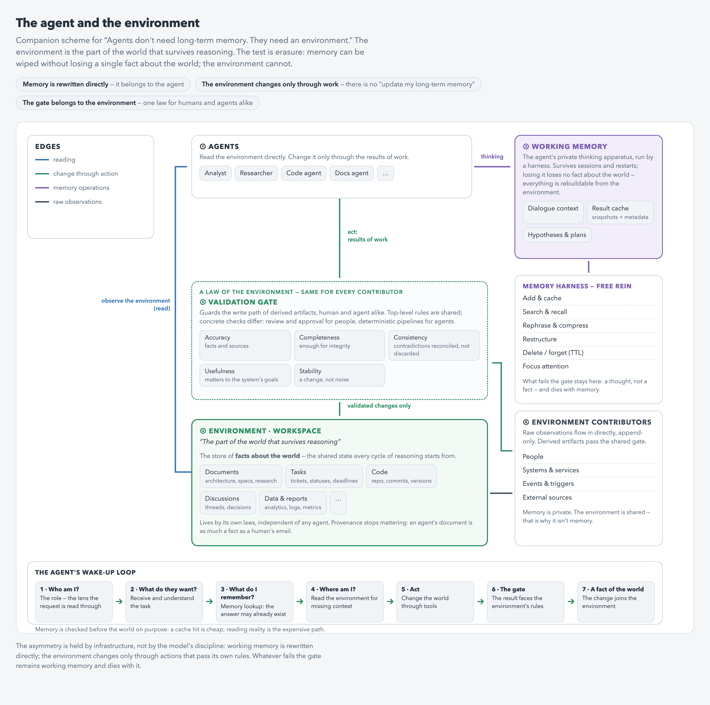

# Agents don't need long-term memory. They need an environment.

*An agent has exactly one memory — its working memory. Everything else is the world it lives in.*

> **Status: the conceptual foundation of a series.** The architecture built on this paradigm is described in the sequel, [the environment over the chaos](https://github.com/maaakso/environment-over-chaos), and is being tested on one production workspace; the improvement loop that maintains it is [the warehouse loop](https://github.com/maaakso/warehouse-loop).

**TL;DR**

- The unit of agent architecture is not memory. It is the boundary between thinking and reality.
- An agent needs exactly one memory — working memory: session context, caches, recall, expiry, managed by a harness and easily outliving a session. What makes it memory is ownership, not lifetime: the agent may rewrite it freely because nothing in it defines the outside world.
- Everything else is the environment — the part of the world that survives reasoning. The test is erasure: wipe the object; if something is lost forever, it was environment, not memory.
- The asymmetry that defines the architecture: memory is rewritten directly; the environment changes only through work — actions that pass the environment's own rules. There is no operation called "update my long-term memory."
- Most memory architectures teach the agent to remember more. This one forbids it to remember anything it didn't do.

## The problem

Most agent architectures are built around memory. Short-term context, long-term memory, RAG, profile memory. Implementations differ in detail, but the assumption underneath is the same: everything the agent knows is some form of memory.

In this model the workspace becomes one more knowledge store the agent keeps updating, and the difference between short-term and long-term is reduced to data lifetime and storage format.

I think this is the wrong unit of architecture.

## The unit of architecture

The unit of architecture is not memory. It is the boundary between **thinking** and **reality**.

An agent does need memory, but exactly one — working memory. And it is more than a context window. It is the agent's whole private apparatus of thinking: session context, caches of past results with snapshots and metadata, search and recall over them, expiry and pruning. A harness manages it, and it can easily outlive a session.

What makes it memory is not lifetime but ownership. The agent rewrites, compresses, restructures and discards it freely, because nothing in it defines the state of the outside world.

The workspace is not something the agent remembers. It is the environment the agent lives in.

The definition is a test, not a metaphor: **the environment is the part of the world that survives reasoning.** The test is erasure, not lifetime. Wipe the object: if every fact about the world is still intact — it was memory, and the agent can rebuild it from the environment at the cost of some compute. If something is lost forever — it was the environment.

## The law of asymmetry

One asymmetry defines the architecture: **memory is rewritten directly. The environment is not.**

The agent freely rewrites its own reasoning. It cannot rewrite a document, close a task or change the architecture because it changed its mind. There is no operation called "update my long-term memory."

The environment changes through work, and only through work.

A written document becomes part of the environment. A commit changes the code. A closed task changes the project. A finished investigation becomes a new fact.

And the environment changes forward: new state supersedes the old; history is not rewritten.

Reasoning modifies memory. Actions modify the environment.

## Why this matters

If the agent can rewrite its long-term memory directly, reasoning and reality collapse into a single layer. Every new conclusion gains the power to edit the knowledge it was derived from. The smarter the agent, the less it should be trusted with write access to its own world model.

There is a second reason, and it is structural. Memory is private. The environment is shared. Humans, services, scheduled jobs and other agents write to it — writers the agent does not control. A store that other actors update independently cannot be anyone's memory by definition.

The two properties meet in one place: once a result lands in the environment, its origin stops mattering. A document written by an agent is as much a fact of the working world as an email from a human. The next cycle of reasoning treats both the same way.

## The environment has its own laws

One more rule follows.

The environment is not an extension of anyone's reasoning, so not every output deserves to exist in it. Drafts, dead hypotheses, intermediate conclusions and hallucinations die with working memory. They helped the agent think; that is not a claim on reality.

What enters the environment is decided by the environment's own rules — and the law is the same for every contributor. A human's document passes review and merge; an agent's conclusion passes a validation pipeline. The top-level rules — accuracy, completeness, consistency, usefulness, stability — do not depend on who is writing. Only the concrete checks do. The gate belongs to the environment, not to the contributor; an agent grading its own results would be an agent rewriting its memory with extra steps.

The gate guards derived artifacts, not the world itself. Raw observations — messages, commits, telemetry — stream into the environment as append-only facts regardless of anyone. What faces validation is the derived layer: conclusions, summaries, decisions.

Two laws of the environment remain open here: how its rules should be built, and how an agent reads a world far too large to read — attention, not just retrieval. Both end up mattering more than the model. That is the next article.

## The loop

In practice the boundary shows up as a sequence of questions the agent answers on every wake-up.

*Who am I* — the role, loaded before the request, because it is the lens the request will be read through. *What do they want* — the task itself. *What do I remember* — a lookup in its own memory: perhaps the answer already exists and the world doesn't need to be touched at all. *Where am I* — reading the environment for the context memory doesn't hold. Then it acts. Then the result faces the environment's rules and either becomes a fact of the world or remains a thought.

Memory is checked before the world on purpose: a cache hit is cheap, reading reality is the expensive path. But memory is a hypothesis about the world, never its source of truth — a hit is verified against the environment, not trusted.

## Prior art

The failure this prevents is measured, not hypothetical. Agents given naive free-write memory degrade as it grows: 65.2% task completion without forgetting versus 92.5% with it on long horizons, replicated independently ([arXiv:2505.16067](https://arxiv.org/abs/2505.16067)); iterative LLM rewriting of stored content produces documented semantic drift. Individual mechanisms exist too: bi-temporal facts where contradictions close validity windows instead of deleting anything (Zep/Graphiti, [arXiv:2501.13956](https://arxiv.org/abs/2501.13956)), salience gates that reject inputs before write (CraniMem, [arXiv:2603.15642](https://arxiv.org/html/2603.15642)), world state and artifact stores in most agent frameworks.

The lineage is older still. The agent–environment loop is the founding frame of reinforcement learning; shared workspaces written by many actors go back to blackboard architectures and stigmergy; "append-only observations with rebuilt views" is event sourcing by another name. And practitioners already half-live by this model: for a coding agent the repository is the environment and the pull request is the gate.

None of the parts are new. What is not established is the composition: refusing to call the persistent layer memory at all, defining it as the part of the world that survives reasoning, and granting write access to it — for agents and humans alike — only through actions that pass the environment's own rules. Most memory architectures teach the agent to remember more. This one forbids it to remember anything it didn't do.

## The point

Don't build the agent a bigger memory. Build it a world. Give it one scratchpad it owns completely — and an environment it can change only by doing work that survives the environment's own rules.

## License

Text and diagrams: [CC BY 4.0](LICENSE). If code appears in this repository later, it will carry its own permissive license (MIT or Apache-2.0).
